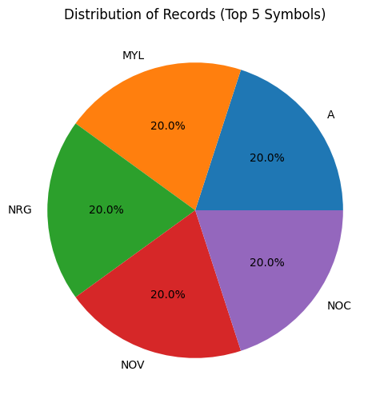
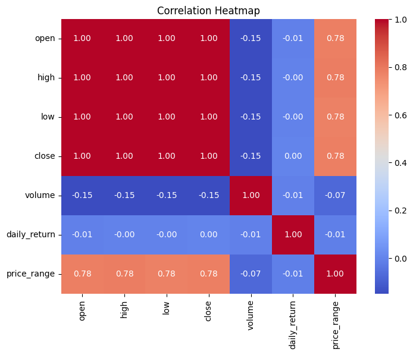
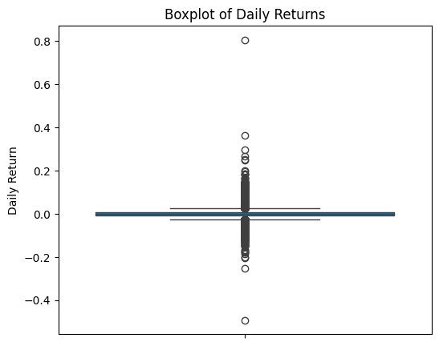
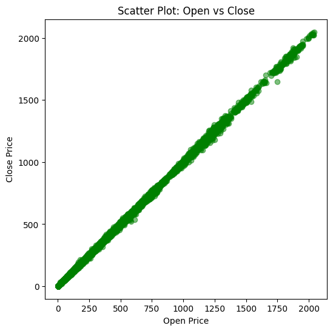

##  Level 1
### Task 1: Data Cleaning and Preprocessing


```python
import pandas as pd
import numpy as np
import matplotlib.pyplot as plt
import seaborn as sns
```


```python
df = pd.read_csv('/Users/bhavesh/Desktop/codeved/dataset/2) Stock Prices Data Set.csv')
```


```python
df.head()
```


<div>
<style scoped>
    .dataframe tbody tr th:only-of-type {
        vertical-align: middle;
    }

    .dataframe tbody tr th {
        vertical-align: top;
    }

    .dataframe thead th {
        text-align: right;
    }
</style>
<table border="1" class="dataframe">
  <thead>
    <tr style="text-align: right;">
      <th></th>
      <th>symbol</th>
      <th>date</th>
      <th>open</th>
      <th>high</th>
      <th>low</th>
      <th>close</th>
      <th>volume</th>
    </tr>
  </thead>
  <tbody>
    <tr>
      <th>0</th>
      <td>AAL</td>
      <td>2014-01-02</td>
      <td>25.0700</td>
      <td>25.8200</td>
      <td>25.0600</td>
      <td>25.3600</td>
      <td>8998943</td>
    </tr>
    <tr>
      <th>1</th>
      <td>AAPL</td>
      <td>2014-01-02</td>
      <td>79.3828</td>
      <td>79.5756</td>
      <td>78.8601</td>
      <td>79.0185</td>
      <td>58791957</td>
    </tr>
    <tr>
      <th>2</th>
      <td>AAP</td>
      <td>2014-01-02</td>
      <td>110.3600</td>
      <td>111.8800</td>
      <td>109.2900</td>
      <td>109.7400</td>
      <td>542711</td>
    </tr>
    <tr>
      <th>3</th>
      <td>ABBV</td>
      <td>2014-01-02</td>
      <td>52.1200</td>
      <td>52.3300</td>
      <td>51.5200</td>
      <td>51.9800</td>
      <td>4569061</td>
    </tr>
    <tr>
      <th>4</th>
      <td>ABC</td>
      <td>2014-01-02</td>
      <td>70.1100</td>
      <td>70.2300</td>
      <td>69.4800</td>
      <td>69.8900</td>
      <td>1148391</td>
    </tr>
  </tbody>
</table>
</div>


```python
print("Initial shape:", df.shape)
```

    Initial shape: (497472, 7)


```python
df.info()
```

    <class 'pandas.core.frame.DataFrame'>
    RangeIndex: 497472 entries, 0 to 497471
    Data columns (total 7 columns):
     #   Column  Non-Null Count   Dtype  
    ---  ------  --------------   -----  
     0   symbol  497472 non-null  object 
     1   date    497472 non-null  object 
     2   open    497461 non-null  float64
     3   high    497464 non-null  float64
     4   low     497464 non-null  float64
     5   close   497472 non-null  float64
     6   volume  497472 non-null  int64  
    dtypes: float64(4), int64(1), object(2)
    memory usage: 26.6+ MB


```python
df['date'] = pd.to_datetime(df['date'], errors='coerce')

```


```python
df.isnull().sum()
```


    symbol     0
    date       0
    open      11
    high       8
    low        8
    close      0
    volume     0
    dtype: int64


```python
df.duplicated().sum()
```


    0


```python
#df.drop_duplicates(inplace=True)
```


```python
df = df.sort_values(["symbol", "date"]).reset_index(drop=True)

```


```python
df
```


<div>
<style scoped>
    .dataframe tbody tr th:only-of-type {
        vertical-align: middle;
    }

    .dataframe tbody tr th {
        vertical-align: top;
    }

    .dataframe thead th {
        text-align: right;
    }
</style>
<table border="1" class="dataframe">
  <thead>
    <tr style="text-align: right;">
      <th></th>
      <th>symbol</th>
      <th>date</th>
      <th>open</th>
      <th>high</th>
      <th>low</th>
      <th>close</th>
      <th>volume</th>
    </tr>
  </thead>
  <tbody>
    <tr>
      <th>0</th>
      <td>A</td>
      <td>2014-01-02</td>
      <td>57.10</td>
      <td>57.100</td>
      <td>56.15</td>
      <td>56.21</td>
      <td>1916160</td>
    </tr>
    <tr>
      <th>1</th>
      <td>A</td>
      <td>2014-01-03</td>
      <td>56.39</td>
      <td>57.345</td>
      <td>56.26</td>
      <td>56.92</td>
      <td>1866651</td>
    </tr>
    <tr>
      <th>2</th>
      <td>A</td>
      <td>2014-01-06</td>
      <td>57.40</td>
      <td>57.700</td>
      <td>56.56</td>
      <td>56.64</td>
      <td>1777472</td>
    </tr>
    <tr>
      <th>3</th>
      <td>A</td>
      <td>2014-01-07</td>
      <td>56.95</td>
      <td>57.630</td>
      <td>56.93</td>
      <td>57.45</td>
      <td>1463208</td>
    </tr>
    <tr>
      <th>4</th>
      <td>A</td>
      <td>2014-01-08</td>
      <td>57.33</td>
      <td>58.540</td>
      <td>57.17</td>
      <td>58.39</td>
      <td>2659468</td>
    </tr>
    <tr>
      <th>...</th>
      <td>...</td>
      <td>...</td>
      <td>...</td>
      <td>...</td>
      <td>...</td>
      <td>...</td>
      <td>...</td>
    </tr>
    <tr>
      <th>497467</th>
      <td>ZTS</td>
      <td>2017-12-22</td>
      <td>72.30</td>
      <td>72.370</td>
      <td>71.79</td>
      <td>71.99</td>
      <td>1345683</td>
    </tr>
    <tr>
      <th>497468</th>
      <td>ZTS</td>
      <td>2017-12-26</td>
      <td>72.40</td>
      <td>72.550</td>
      <td>71.90</td>
      <td>72.34</td>
      <td>792134</td>
    </tr>
    <tr>
      <th>497469</th>
      <td>ZTS</td>
      <td>2017-12-27</td>
      <td>72.59</td>
      <td>72.690</td>
      <td>72.25</td>
      <td>72.45</td>
      <td>1159771</td>
    </tr>
    <tr>
      <th>497470</th>
      <td>ZTS</td>
      <td>2017-12-28</td>
      <td>72.49</td>
      <td>72.600</td>
      <td>72.14</td>
      <td>72.39</td>
      <td>710499</td>
    </tr>
    <tr>
      <th>497471</th>
      <td>ZTS</td>
      <td>2017-12-29</td>
      <td>72.55</td>
      <td>72.760</td>
      <td>72.04</td>
      <td>72.04</td>
      <td>1704122</td>
    </tr>
  </tbody>
</table>
<p>497472 rows × 7 columns</p>
</div>


```python
for col in ["open", "high", "low"]:
    df[col] = df.groupby("symbol")[col].ffill().bfill()
```


```python
df.isnull().sum()
```


    symbol    0
    date      0
    open      0
    high      0
    low       0
    close     0
    volume    0
    dtype: int64


```python
df['daily_return'] = (df['close']-df["open"])/df['open']
df['price_range'] = df['high'] -df['low']
df["year"] = df['date'].dt.year
df["month"] = df["date"].dt.month
df['weekday'] = df['date'].dt.day_name()
```


```python
df
```


<div>
<style scoped>
    .dataframe tbody tr th:only-of-type {
        vertical-align: middle;
    }

    .dataframe tbody tr th {
        vertical-align: top;
    }

    .dataframe thead th {
        text-align: right;
    }
</style>
<table border="1" class="dataframe">
  <thead>
    <tr style="text-align: right;">
      <th></th>
      <th>symbol</th>
      <th>date</th>
      <th>open</th>
      <th>high</th>
      <th>low</th>
      <th>close</th>
      <th>volume</th>
      <th>daily_return</th>
      <th>price_range</th>
      <th>year</th>
      <th>month</th>
      <th>weekday</th>
    </tr>
  </thead>
  <tbody>
    <tr>
      <th>0</th>
      <td>A</td>
      <td>2014-01-02</td>
      <td>57.10</td>
      <td>57.100</td>
      <td>56.15</td>
      <td>56.21</td>
      <td>1916160</td>
      <td>-0.015587</td>
      <td>0.950</td>
      <td>2014</td>
      <td>1</td>
      <td>Thursday</td>
    </tr>
    <tr>
      <th>1</th>
      <td>A</td>
      <td>2014-01-03</td>
      <td>56.39</td>
      <td>57.345</td>
      <td>56.26</td>
      <td>56.92</td>
      <td>1866651</td>
      <td>0.009399</td>
      <td>1.085</td>
      <td>2014</td>
      <td>1</td>
      <td>Friday</td>
    </tr>
    <tr>
      <th>2</th>
      <td>A</td>
      <td>2014-01-06</td>
      <td>57.40</td>
      <td>57.700</td>
      <td>56.56</td>
      <td>56.64</td>
      <td>1777472</td>
      <td>-0.013240</td>
      <td>1.140</td>
      <td>2014</td>
      <td>1</td>
      <td>Monday</td>
    </tr>
    <tr>
      <th>3</th>
      <td>A</td>
      <td>2014-01-07</td>
      <td>56.95</td>
      <td>57.630</td>
      <td>56.93</td>
      <td>57.45</td>
      <td>1463208</td>
      <td>0.008780</td>
      <td>0.700</td>
      <td>2014</td>
      <td>1</td>
      <td>Tuesday</td>
    </tr>
    <tr>
      <th>4</th>
      <td>A</td>
      <td>2014-01-08</td>
      <td>57.33</td>
      <td>58.540</td>
      <td>57.17</td>
      <td>58.39</td>
      <td>2659468</td>
      <td>0.018489</td>
      <td>1.370</td>
      <td>2014</td>
      <td>1</td>
      <td>Wednesday</td>
    </tr>
    <tr>
      <th>...</th>
      <td>...</td>
      <td>...</td>
      <td>...</td>
      <td>...</td>
      <td>...</td>
      <td>...</td>
      <td>...</td>
      <td>...</td>
      <td>...</td>
      <td>...</td>
      <td>...</td>
      <td>...</td>
    </tr>
    <tr>
      <th>497467</th>
      <td>ZTS</td>
      <td>2017-12-22</td>
      <td>72.30</td>
      <td>72.370</td>
      <td>71.79</td>
      <td>71.99</td>
      <td>1345683</td>
      <td>-0.004288</td>
      <td>0.580</td>
      <td>2017</td>
      <td>12</td>
      <td>Friday</td>
    </tr>
    <tr>
      <th>497468</th>
      <td>ZTS</td>
      <td>2017-12-26</td>
      <td>72.40</td>
      <td>72.550</td>
      <td>71.90</td>
      <td>72.34</td>
      <td>792134</td>
      <td>-0.000829</td>
      <td>0.650</td>
      <td>2017</td>
      <td>12</td>
      <td>Tuesday</td>
    </tr>
    <tr>
      <th>497469</th>
      <td>ZTS</td>
      <td>2017-12-27</td>
      <td>72.59</td>
      <td>72.690</td>
      <td>72.25</td>
      <td>72.45</td>
      <td>1159771</td>
      <td>-0.001929</td>
      <td>0.440</td>
      <td>2017</td>
      <td>12</td>
      <td>Wednesday</td>
    </tr>
    <tr>
      <th>497470</th>
      <td>ZTS</td>
      <td>2017-12-28</td>
      <td>72.49</td>
      <td>72.600</td>
      <td>72.14</td>
      <td>72.39</td>
      <td>710499</td>
      <td>-0.001380</td>
      <td>0.460</td>
      <td>2017</td>
      <td>12</td>
      <td>Thursday</td>
    </tr>
    <tr>
      <th>497471</th>
      <td>ZTS</td>
      <td>2017-12-29</td>
      <td>72.55</td>
      <td>72.760</td>
      <td>72.04</td>
      <td>72.04</td>
      <td>1704122</td>
      <td>-0.007030</td>
      <td>0.720</td>
      <td>2017</td>
      <td>12</td>
      <td>Friday</td>
    </tr>
  </tbody>
</table>
<p>497472 rows × 12 columns</p>
</div>


##  Level 1
### Task 2: Exploratory Data Analysis (EDA)


```python
df.describe()
```


<div>
<style scoped>
    .dataframe tbody tr th:only-of-type {
        vertical-align: middle;
    }

    .dataframe tbody tr th {
        vertical-align: top;
    }

    .dataframe thead th {
        text-align: right;
    }
</style>
<table border="1" class="dataframe">
  <thead>
    <tr style="text-align: right;">
      <th></th>
      <th>date</th>
      <th>open</th>
      <th>high</th>
      <th>low</th>
      <th>close</th>
      <th>volume</th>
      <th>daily_return</th>
      <th>price_range</th>
      <th>year</th>
      <th>month</th>
    </tr>
  </thead>
  <tbody>
    <tr>
      <th>count</th>
      <td>497472</td>
      <td>497472.000000</td>
      <td>497472.000000</td>
      <td>497472.000000</td>
      <td>497472.000000</td>
      <td>4.974720e+05</td>
      <td>497472.000000</td>
      <td>497472.000000</td>
      <td>497472.000000</td>
      <td>497472.000000</td>
    </tr>
    <tr>
      <th>mean</th>
      <td>2016-01-06 17:16:00.439984128</td>
      <td>86.352811</td>
      <td>87.133263</td>
      <td>85.553119</td>
      <td>86.369082</td>
      <td>4.253611e+06</td>
      <td>0.000307</td>
      <td>1.580144</td>
      <td>2015.512574</td>
      <td>6.563521</td>
    </tr>
    <tr>
      <th>min</th>
      <td>2014-01-02 00:00:00</td>
      <td>1.620000</td>
      <td>1.690000</td>
      <td>1.500000</td>
      <td>1.590000</td>
      <td>0.000000e+00</td>
      <td>-0.492185</td>
      <td>-0.255000</td>
      <td>2014.000000</td>
      <td>1.000000</td>
    </tr>
    <tr>
      <th>25%</th>
      <td>2015-01-08 00:00:00</td>
      <td>41.690000</td>
      <td>42.090000</td>
      <td>41.280000</td>
      <td>41.703750</td>
      <td>1.080166e+06</td>
      <td>-0.006256</td>
      <td>0.630000</td>
      <td>2015.000000</td>
      <td>4.000000</td>
    </tr>
    <tr>
      <th>50%</th>
      <td>2016-01-11 00:00:00</td>
      <td>64.970000</td>
      <td>65.560000</td>
      <td>64.353700</td>
      <td>64.980000</td>
      <td>2.084896e+06</td>
      <td>0.000414</td>
      <td>1.030000</td>
      <td>2016.000000</td>
      <td>7.000000</td>
    </tr>
    <tr>
      <th>75%</th>
      <td>2017-01-06 00:00:00</td>
      <td>98.410000</td>
      <td>99.230000</td>
      <td>97.580000</td>
      <td>98.420000</td>
      <td>4.271928e+06</td>
      <td>0.007050</td>
      <td>1.730000</td>
      <td>2017.000000</td>
      <td>10.000000</td>
    </tr>
    <tr>
      <th>max</th>
      <td>2017-12-29 00:00:00</td>
      <td>2044.000000</td>
      <td>2067.990000</td>
      <td>2035.110000</td>
      <td>2049.000000</td>
      <td>6.182376e+08</td>
      <td>0.805807</td>
      <td>109.900000</td>
      <td>2017.000000</td>
      <td>12.000000</td>
    </tr>
    <tr>
      <th>std</th>
      <td>NaN</td>
      <td>101.472255</td>
      <td>102.313357</td>
      <td>100.572151</td>
      <td>101.472407</td>
      <td>8.232139e+06</td>
      <td>0.013363</td>
      <td>2.231448</td>
      <td>1.117412</td>
      <td>3.424045</td>
    </tr>
  </tbody>
</table>
</div>


```python
print("\nNumber of symbols:", df["symbol"].nunique())
print(df["symbol"].value_counts())
```

    
    Number of symbols: 505
    symbol
    A       1007
    MYL     1007
    NRG     1007
    NOV     1007
    NOC     1007
            ... 
    DXC      189
    BHGE     126
    BHF      117
    DWDP      83
    APTV      18
    Name: count, Length: 505, dtype: int64


```python
# Top 10 symbols by number of records
top_symbols = df["symbol"].value_counts().head(10)
top_symbols
```


    symbol
    A       1007
    MYL     1007
    NRG     1007
    NOV     1007
    NOC     1007
    NLSN    1007
    NKE     1007
    NI      1007
    NFX     1007
    NFLX    1007
    Name: count, dtype: int64


```python
corr = df[["open","high","low","close","volume","daily_return","price_range"]].corr()
print("\nCorrelation matrix:\n", corr)
```

    
    Correlation matrix:
                       open      high       low     close    volume  daily_return  \
    open          1.000000  0.999941  0.999928  0.999876 -0.148724     -0.007520   
    high          0.999941  1.000000  0.999905  0.999938 -0.148344     -0.002509   
    low           0.999928  0.999905  1.000000  0.999941 -0.149284     -0.002251   
    close         0.999876  0.999938  0.999941  1.000000 -0.148839      0.002441   
    volume       -0.148724 -0.148344 -0.149284 -0.148839  1.000000     -0.008677   
    daily_return -0.007520 -0.002509 -0.002251  0.002441 -0.008677      1.000000   
    price_range   0.780852  0.784568  0.775964  0.780100 -0.073391     -0.013568   
    
                  price_range  
    open             0.780852  
    high             0.784568  
    low              0.775964  
    close            0.780100  
    volume          -0.073391  
    daily_return    -0.013568  
    price_range      1.000000  


```python
##  Level 1
### Task 3: Visualizations
```


```python
#Pie chart of record distribution across 5 symbols
df['symbol'].value_counts().head(5).plot(kind='pie', autopct='%1.1f%%', figsize=(6,6))
plt.title("Distribution of Records (Top 5 Symbols)")
plt.ylabel("")
plt.show()
```


    

    


```python
# 3) Correlation heatmap
plt.figure(figsize=(8,6))
sns.heatmap(corr, annot=True, cmap="coolwarm", fmt=".2f")
plt.title("Correlation Heatmap")
plt.show()

```


    

    


```python
# 4) Boxplot of daily returns
plt.figure(figsize=(6,5))
sns.boxplot(y=df["daily_return"])
plt.title("Boxplot of Daily Returns")
plt.ylabel("Daily Return")
plt.show()

```


    

    


```python
#Time series of closing price for 3 popular symbols
symbols_to_plot = top_symbols.index[:3]
plt.figure(figsize=(12,5))
for sym in symbols_to_plot:
    subset = df[df["symbol"] == sym]
    plt.plot(subset["date"], subset["close"], label=sym)
plt.title("Closing Price Time Series (Top 3 Symbols)")
plt.xlabel("Date")
plt.ylabel("Close Price")
plt.legend()
plt.show()

```


    

    


```python
 #Scatter plot: Open vs Close
plt.figure(figsize=(6,6))
plt.scatter(df['open'], df['close'], alpha=0.5, color='green')
plt.title("Scatter Plot: Open vs Close")
plt.xlabel("Open Price")
plt.ylabel("Close Price")
plt.show()
```


    

    


```python

```
